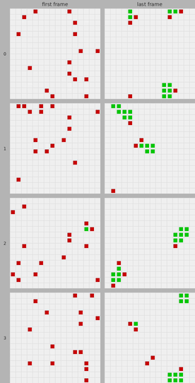
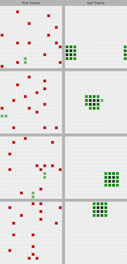

# Torus swarm

Decentralized swarm agents trained with PPO to self-organize into compact formations on a toroidal grid. This explores emergent coordination in a symmetric multi-agent system.

The best possible result is to form a square, where the mean number of neighbours across agents is 3.0 (the highest possible). The agents use a shared policy learn to self-organise into compact formations using only local observations and density rewards. This can also be viewed as minimizing agents' local energy density, with the energy density for an agent being minus the number of its neighbours. The information an agent can use to reduce that energy is purely local to that particular agent.

A next step would be to introduce an asymmetry: in the environment or amongst the agents.

## Overview

- **N agents** on an **L×L torus**; each agent sees only its local **(2r+1)²** patch
- **Decentralized policy**: `a_i = π(o_i)` — no cross-agent information at inference time
- **Reward**: mean Manhattan-1 neighbours per agent (theoretical max 3.0 = solid 4×4 block)
- Trained with [Stable-Baselines3](https://github.com/DLR-RM/stable-baselines3) PPO + custom `FactorizedSwarmPolicy`

## Example of results

The table below shows four examples after training with a naive training configuration ("Early run") and a training configuration ("Best run") honed both by Optuna and manually. For each run, a pair of "First frame" and "Last frame" shows the beginning and end of an episode. Three of the four "Best run" episodes show optimal results, with the other being just sub-optimal.

| Early run | Best run |
|-----------|----------|
|  |  |

## Quick Start

```bash
git clone <url> && cd torus-swarm/src
python -m venv .venv && source .venv/bin/activate
pip install -r ../requirements.txt
python localized_actions.py            # trains on L=16, N=16, r=4
```

Artifacts go to `runs/<timestamp>_localized_actions/`.

## Project Structure

```
src/
  localized_actions.py   # Training entry point + FactorizedSwarmPolicy
  load_and_eval.py       # Load + evaluate a saved model
  optuna_optimize.py     # Hyperparameter search via Optuna
  swarm/
    swarm_life_sb3.py    # Gymnasium env (SwarmLifePatternEnv + config)
    callbacks.py         # EvalCallbackWithNumGood (metrics, videos)
    run_artifacts.py     # Timestamped run directory management
  utils/
    make_eval_grid.py    # Generate eval_grid.html from recorded videos
  tests/                 # pytest suite
docs/
  num_good_maximum_proof.md      # Proof that max mean_num_good = 3.0
  hyperparameter-analysis.md     # Optuna study results (64 trials)
examples/
  early-run/             First working run (mean_num_good ≈ 1.95)
  best-run/              Best Optuna trial (mean_num_good ≈ 2.96)
runs/                    # Training artifacts (gitignored)
```

## Environment (`SwarmLifePatternConfig`)

Key environment config values:

| L  | N  | r | T   | include_abs_pos | move_penalty | collision_penalty |
|----|----|---|-----|-----------------|--------------|-------------------|
| 16 | 16 | 4 | 16 | False            | 1e-3         | 0.01              |

The training script (`localized_actions.py`) uses L=16, N=16, r=4, T=16.

- **Observation**: flat `(N×C×P×P,)` float32 vector; `C=1` or `3` (with abs pos); `P=2r+1`
- **Action**: `MultiDiscrete([5]*N)` — stay / up / down / left / right
- **Collision**: synchronous rejection if destination is occupied or multi-agent conflict
- **Reward**: mean capped neighbour count minus movement and collision penalties

## Policy Architecture

`FactorizedSwarmPolicy` applies a shared `PerAgentCNN` (2-conv + MLP) independently to each agent's patch, producing a per-agent embedding of dimension `per_agent_dim`. A shared actor linear layer (`D→5`) maps each embedding to action logits with no cross-agent mixing. A centralized `CriticMLP` takes the mean-pooled embeddings and outputs a scalar value estimate.

## Commands

Activate the venv first:

```bash
cd src && source .venv/bin/activate
```

**Single training run**

```bash
python localized_actions.py
python localized_actions.py --run-name my-experiment
```

**Load and evaluate a saved model**

```bash
python load_and_eval.py --run-dir ../runs/<dir> [--seed 42] [--deterministic]
```

**Hyperparameter optimization**

```bash
python optuna_optimize.py --study-name my-study --n-trials 20 --total-timesteps 500000
# Resume a study:
python optuna_optimize.py --study-name my-study --storage sqlite:///runs/optuna_.../optuna_study.db
```

**Generate eval grid**

```bash
python utils/make_eval_grid.py ../runs/<run_dir>
```

**Tests**

```bash
pytest tests/
pytest tests/test_swarm_life_collision_swap.py::test_pairwise_swap_both_bounce_back
```

## Examples

Pre-trained runs are included in `examples/` for reference and to test `load_and_eval.py` without running a full training job.

```
examples/
  early-run/       First working run — default hyperparams, 262k timesteps, mean_num_good ≈ 1.95
  best-run/        Best Optuna trial (trial 4) — 2M timesteps, mean_num_good ≈ 2.96
```

Each example has the same layout as a live run (see **Training Artifacts** below). To evaluate one:

```bash
python load_and_eval.py --run-dir ../examples/best-run/optuna_2026-03-03T22-49-18_confirm-abs_posn-False--set-norm-obs-False--inc-timesteps/trial_4
```

Results of such a run, with a different environent seed from training, can been viewed in `../examples/best-run/videos/trial_4/load_eval-different-seed-episode--0.mp4`. This shows the best possible end result: a square (num_good = 3.0).

## Training Artifacts

Each run creates a timestamped directory under `runs/`:

```
runs/<timestamp>_localized_actions/
  config.json        env + PPO hyperparameters
  model.zip          saved PPO model
  vecnorm.pkl        VecNormalize stats (if enabled)
  final_eval.json    eval metrics including mean_num_good
  eval_grid.html     first/last-frame visual grid for all eval episodes
  eval/              eval logs (numpy arrays for tensorboard)
  videos/            MP4 eval episode recordings
  checkpoints/       best model checkpoint
```

## Hyperparameter Optimization

Fixed: L=16, N=16, r=4. Objective: maximize `mean_num_good`.

Best score achieved across 64 trials: **2.725** (see [`docs/hyperparameter-analysis.md`](docs/hyperparameter-analysis.md)).

Uses TPE sampler with SQLite storage — studies are fully resumable.

## Dependencies

- Python 3.10
- `gymnasium >= 1.0.0`
- `stable-baselines3 >= 2.0.0`
- `optuna >= 4.7.0`
- `imageio[pyav]`

See `requirements.txt` for the full pinned list.
